# Hardware Specs Pricing Intelligence Analysis: Data Cleaning Report Egyptian Laptop Retail Group

## Overview
The Egyptian Laptop Retail Group is a technology-focused retailer offering a wide range of laptops across multiple brands, price segments, and performance tiers. Its portfolio includes entry-level consumer devices, mid-range productivity machines, and high-performance gaming and workstation laptops equipped with advanced CPUs and GPUs.

As competition in the laptop market intensifies, pricing transparency and specification-driven differentiation have become critical factors in maintaining profitability and market positioning. The company aims to better understand how specific hardware configurations influence pricing structures across its product catalog.

## Objective
This analysis provides a comprehensive evaluation of how key hardware specifications particularly processor generation and graphics card type impact the final market price of laptops.

By transforming raw and inconsistent specification data into structured, analysis-ready insights, this project seeks to uncover pricing patterns linked to performance tiers. The findings will support strategic decisions in product positioning, inventory planning, and pricing optimization, ultimately helping leadership align hardware offerings with consumer demand and profitability goals.

## Business Question
How do specific hardware specifications (such as CPU generation and GPU type) influence the final selling price of laptops?

---

## About the Data
The dataset used for this exercise is a dirty laptop raw dataset originally sourced from [Kaggle](https://www.kaggle.com/datasets/waddahali/laptop-prices-and-specifications-dataset)

- **Number of rows:** 1033
- **Number of columns:** 30
- **Content:** Laptop specifications and market prices

The dataset includes attributes such as:

| Column | Description | Data Type |
|---|---|---|
| Brand | The manufacturer of the laptop | Text |
| Processor details | The full commercial name of the laptop model | Text |
| Processor | The main CPU used in the laptop | Text |
| Video graphics | The graphics card installed | Text |
| Video) graphics Memorey | Amount of memory dedicated to the graphics card (e.g., 2GB, 4GB) | Text |
| RAM | Amount of system memory installed | Text |
| Hard drive | Storage capacity and type (e.g., 512GB SSD, 1TB HDD) | Text |
| Display | Screen size or display description (e.g., 15.6 inch) | Text |
| Display Resolution | Screen resolution (e.g., 1920x1080) | Text |
| Display Refresh Rate | Screen refresh rate (e.g., 60Hz, 144Hz) | Text |
| Operating System | Installed OS (e.g., Windows 11, MacOS) | Text |
| Keyboard | Type of keyboard (e.g., backlit, standard, RGB) | Text |
| Battery | Battery capacity or description | Text |
| Webcam | Information about built-in camera (e.g., HD webcam) | Text |
| Connections | Available ports and connectivity options (USB, HDMI, Bluetooth, etc.) | Text |
| Dimensions | Physical size of the laptop (length, width, thickness) | Text |
| Weight | Weight of the laptop (usually in kg) | Text |
| Colors | Available color options | Text |
| Warranty | Warranty duration (e.g., 1 year) | Text |
| Price | Market price of the laptop | Text |
| Processor Generation | Generation of the processor (e.g., 10th Gen, 11th Gen) | Text |
| Processor Details | More detailed processor specifications (cores, speed, etc.) | Text |
| Product number | Unique product ID or model number | Text |
| Power supply type | Type of charger or power adapter used | Text |
| Laptop Color | Specific color of the laptop (may duplicate "Colors") | Text |
| Finger Print | Whether the laptop has a fingerprint sensor (Yes/No) | Boolean |
| SUPPORT SSD M2 | Indicates whether the laptop supports M.2 SSD | Boolean |
| Pointing device | Type of mouse control (touchpad, trackpoint, etc.) | Text |
| Optical drive | Whether it has a CD/DVD drive | Boolean |
| Series | Product series line (e.g., Pavilion, ThinkPad, Inspiron) | Text |
---

[View In Excel](Laptops_Dataset/Laptops_Dataset.xlsx)

## Data Cleaning Process

### 1. Renaming Columns
The column names in the raw dataset contained inconsistencies such as:
- Extra spaces before and after words
- Special characters (e.g., "Brand:" and "Series :")
- Mixed capitalization (e.g., SUPPORT SSD M2)
- Incorrect Spelling (e.g., Video Graphic Memorey)

These inconsistencies can cause errors in formulas, PivotTables, SQL queries, and programming scripts. They also reduce readability and standardization.

To correct this:
- I used the `TRIM()` function to remove leading and trailing spaces.
- I used the `PROPER()` function to standardize capitalization.
- I removed special characters such as colons (`:`) manually.

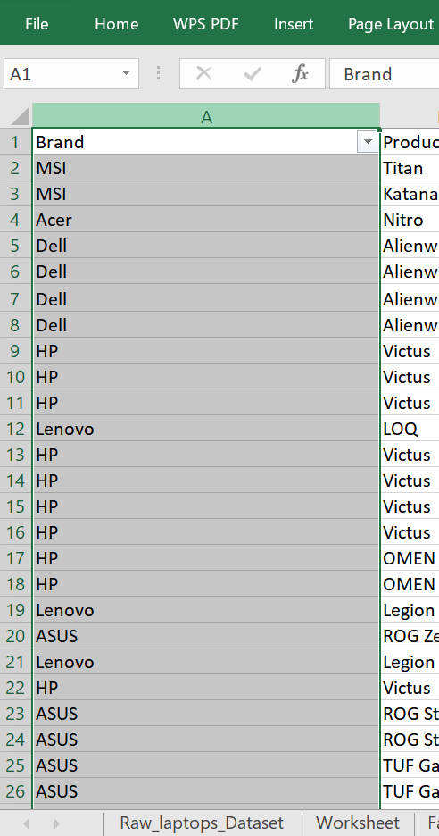

**After**

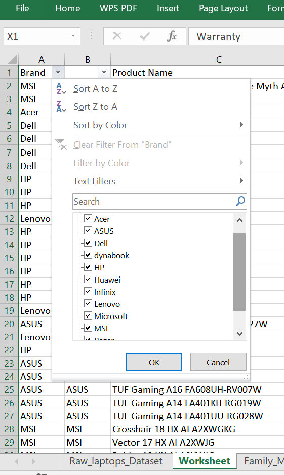

---

### 2. Duplicate Removal
During initial data inspection, duplicate records were identified in the dataset.

Duplicate rows can cause:
- Inflated totals
- Incorrect averages
- Biased statistical results
- Misleading analysis outcomes

I used the **"Remove Duplicates"** feature in Excel's Data Toolbar to remove duplicates.

**Result**

| Metric | Count |
|---|---|
| Original number of rows | 1,033 |
| Duplicate rows found and removed | 19 |
| Final number of rows after removal | 1,014 |

**Before**

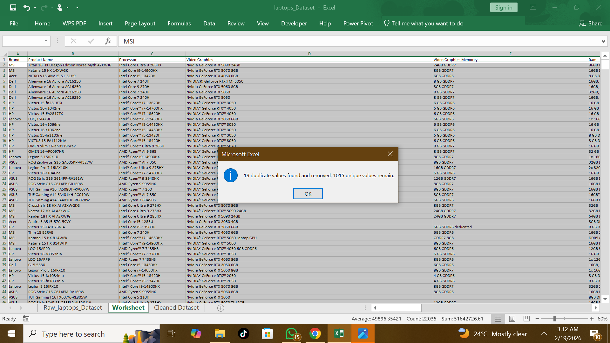

---

### 3. Missing Value Analysis
After duplicate removal, I conducted a missing value assessment to determine the completeness of each column.

To do this:
- I applied a formula to each column to count the number of empty cells. 
- The results were displayed beneath each column header.

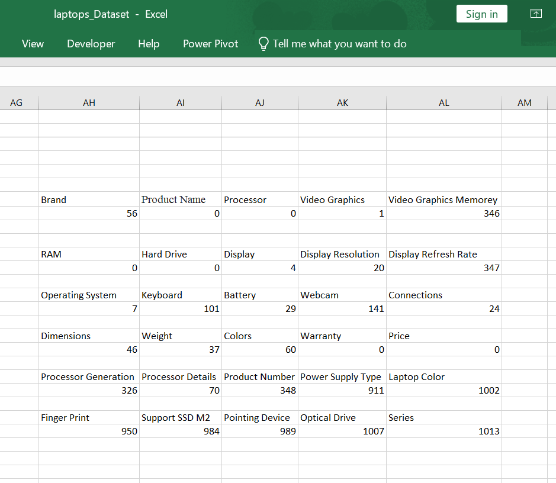

From the worksheet:

| Column | Missing Values |
|---|---|
| Series | 1,013 |
| Optical Drive | 1,007 |
| Laptop Color | 1,002 |
| Pointing Device | 989 |
| Support SSD M2 | 984 |
| Finger Print | 950 |

Given that total rows after duplicate removal were 1,014, these columns were **over 95% empty**, so columns with ≥95% missing values were removed.

Beyond the near-empty columns, several other columns were removed from the working dataset because they were either not relevant to the business question, were too unstructured to clean meaningfully, or duplicated information already captured in better columns. Each column was evaluated against the business question  *"How do hardware specs impact price"* and removed if it did not contribute to answering it.

**Columns removed:**

| Column | Reason |
|---|---|
| Display | Verbose combined field. All useful information (resolution, refresh rate) is already captured in dedicated columns. |
| Keyboard | Peripheral description. Not a core hardware spec that drives price in the analysis. |
| Battery | Stored as unstructured free text with no consistent format across brands. Cleaning would be complex with minimal analytical value. |
| Webcam | Minor accessory feature. Not a hardware performance specification. |
| Connection | Very long text string listing all ports. Extremely difficult to parse and not a primary price driver. |
| Dimension | Physical measurements. Not related to hardware specification pricing. |
| Colors | Cosmetic attribute with no relationship to hardware performance or price. |
| Processor Details | Detailed CPU spec string. Redundant — Processor name and Processor Generation already capture the needed data. |
| Product number | Internal SKU identifier. 34% missing and has no analytical relationship to price. |
| Video graphics | GPU name captured in the cleaned Video Graphics Memory column. Retaining both would be redundant. |

---

### 4. Brand Column Cleaning
The values themselves had inconsistent capitalisation some brands were all lowercase, some mixed case, some all caps. There were also 56 missing values where the brand had not been filled in. Brands like MSI, HP, and ASUS are conventionally written in all uppercase.

A formula was applied that first checks whether the brand is one of the three all-uppercase brands (MSI, HP, ASUS) and keeps them in uppercase, while applying proper title case to all other brands. All leading and trailing spaces were also removed.

**Before**

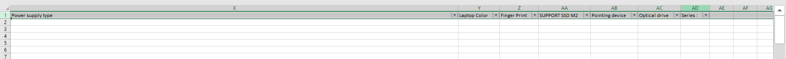

**After**

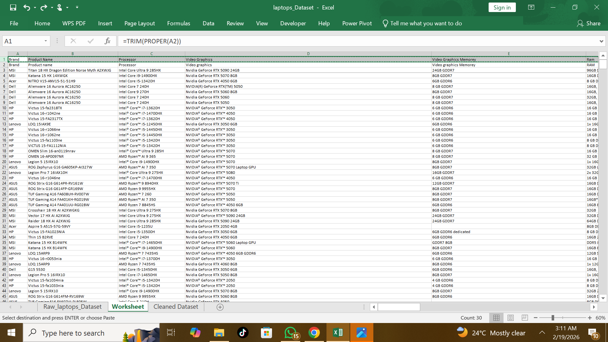

---

### 5. Product Name Column Series Extraction
The Product Name column contained the full commercial product title as one long string (e.g., `'Titan 18 HX Dragon Edition Norse Myth A2XWJG'`). There was no separate column to identify which product family or series a laptop belonged to. The series name appears in different positions within the string and varies in length across brands, so a simple formula extracting a fixed number of characters would not work.

A separate reference worksheet called **Family_Map** was created containing a list of known series keywords (e.g., Titan, Katana, Nitro, ThinkPad, Inspiron) and their standardised series names. A formula was then applied to each product name that searched through every keyword in that list and returned the matching series name. Products that did not match any keyword were labelled as **"Other"**.

> ⚠️ **Significance of "Other"**
>
> Out of **1,015 rows** in the final dataset, **265 records (26.1%)** are classified as **"Other"** in derived categorical columns such as Processor Family and Product Series.
>
> This represents more than **one in four laptops** in the dataset and should not be treated as negligible noise. Possible explanations include:
> - Newer processor or GPU models not yet included in the keyword reference list
> - Niche or regional product lines not captured in the Family_Map reference worksheet
> - Highly varied naming conventions from specific brands (e.g., Chromebook lines, ARM-based devices)

**Before**

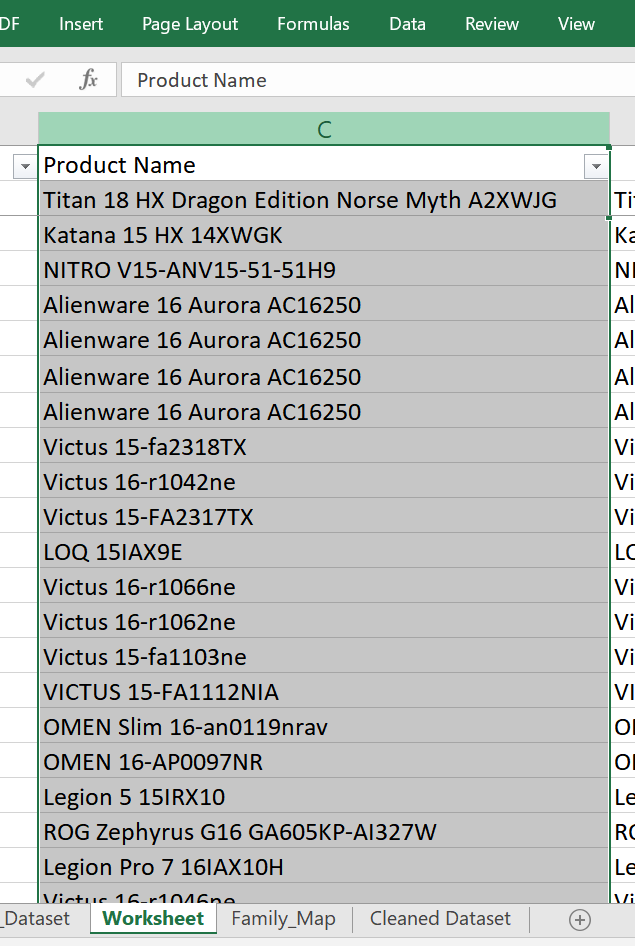

**After**

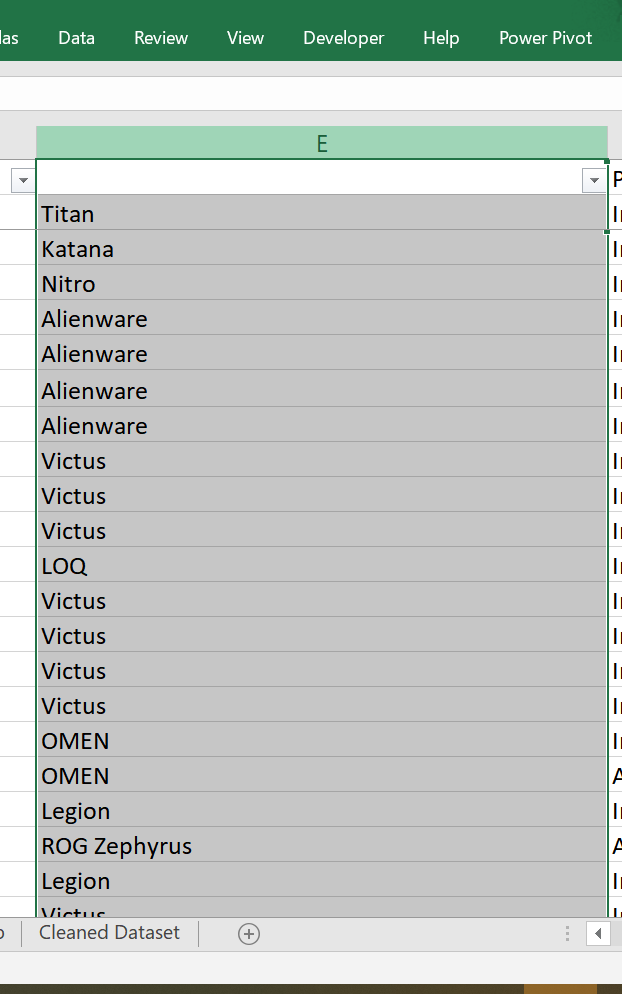

---

### 6. Processor Column Family Extraction
The Processor column contained full CPU model names including special characters, version numbers, clock speeds, and cache sizes (e.g., `'Intel® Core™ i7-13620H'`, `'AMD Ryzen™ AI 9 365'`). The registered trademark and copyright symbols (®, ™) appeared inconsistently across brands. Capitalisation was also inconsistent `'Core I5'` and `'Core i5'` appeared as different values. This made it impossible to group or compare processors without first standardising the family name.

A formula was applied that searches each processor name for specific keywords (such as `'Core Ultra 9'`, `'Core i7'`, `'Ryzen AI 9'`, `'Snapdragon Elite'`) and returns a clean standardised family name. The search is case-insensitive so `'Core I5'` and `'core i5'` both return `'Intel Core i5'`. The formula checks for more specific variants first (e.g., `'Core Ultra 9'` before `'Core 9'`) to avoid mismatches. Processors that do not match any known family are labelled **"Other"**.

**Before**

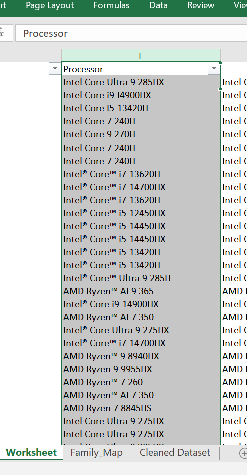

**After**

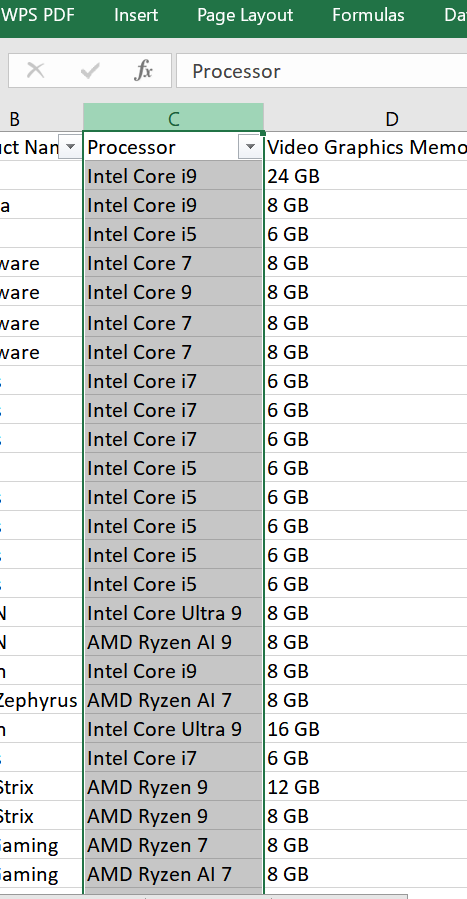

---

### 7. Video Graphic Memory
The column was named `'Video graphics Memorey'` containing a spelling error. The values combined the VRAM size with the memory type in a single string with no consistent format (e.g., `'8GB GDDR7'`, `'8 GB GDDR7'`, `'GDDR7 8GB'`, `'6GB GDDR6 dedicated'`). Some entries placed the number before the unit, others after. Spacing between the number and `'GB'` was inconsistent. 353 values were missing.

The column was renamed to **'GPU Memory'**. A formula was applied in a new adjacent column that finds the first number in the text and extracts everything up to and including the `'GB'` label, regardless of whether the number comes before or after the memory type name.

**Before**

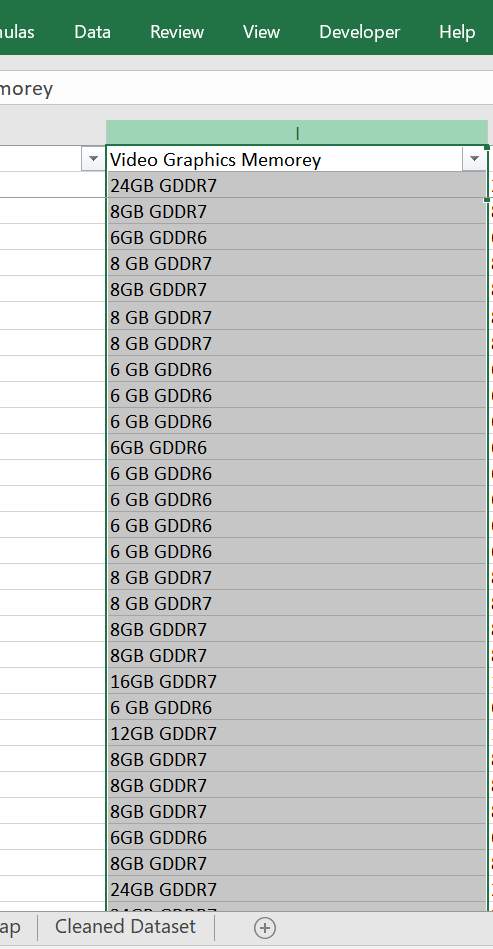

**After**

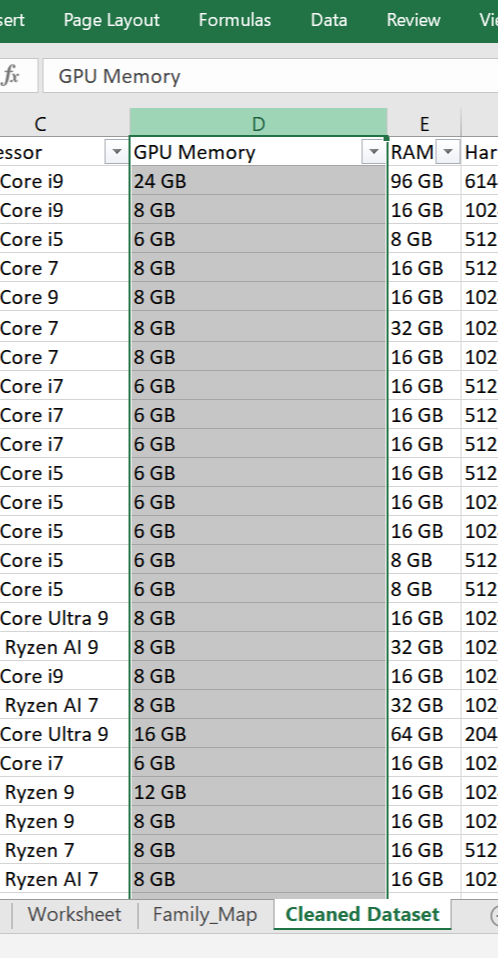

---

### 8. RAM
The RAM column stored values as verbose specification strings that varied significantly in format across brands. Examples included `'96GB DDR5 6400MHz 48GB*2'`, `'16GB, 2x8GB, DDR5, 5600 MT/s (5200 MT/s with Intel Core 5 CPU)'`, and `'8 GB DDR5-SDRAM'`. The actual GB number was embedded somewhere in each string with no consistent position or delimiter.

A formula was applied in a new adjacent column that extracts the first number in the text and returns it as a clean numeric value (no units, no text). This allows the column to be used directly in numerical analysis and calculations.

**Before**

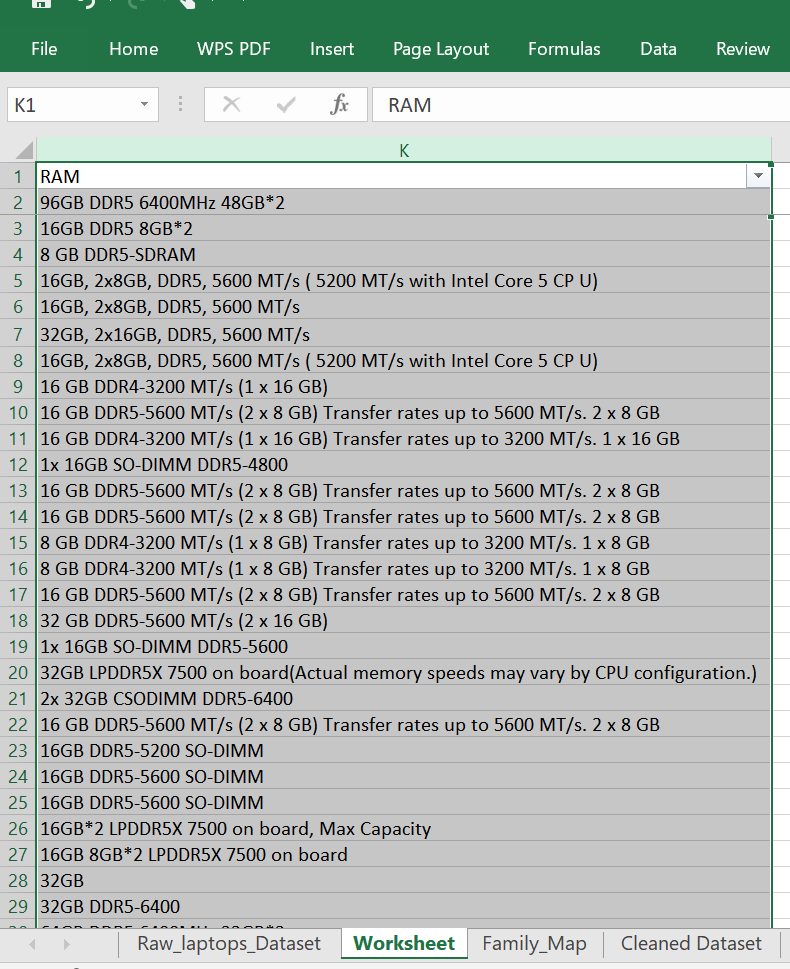

**After**

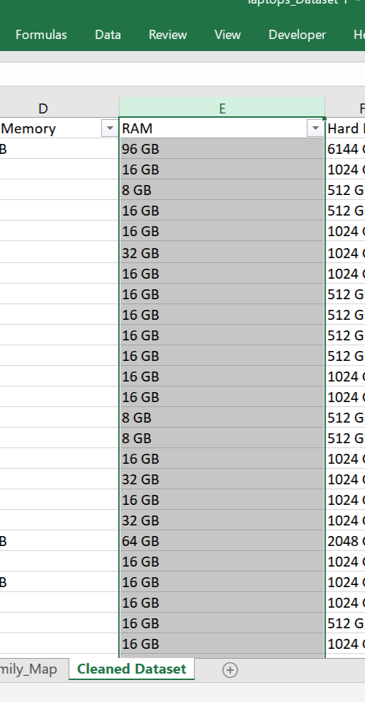

---

### 9. Hard Drive
The Hard Drive column contained very long free-text strings combining storage size, type, interface, and sometimes multiple drives in one cell (e.g., `'6TB, 2TB NVMe PCIe Gen5x4 SSD w/o DRAM + 2TB NVMe PCIe Gen4x4 SSD x2'`). Values used a mix of TB and GB units with no consistency. The raw value was not usable in any numerical analysis.

Two new columns were created alongside the original. The first extracts just the primary storage size as written preserving the original unit (TB or GB). The second converts everything to a consistent GB unit so all values can be numerically compared (TB values are multiplied by 1,024).

**Before**

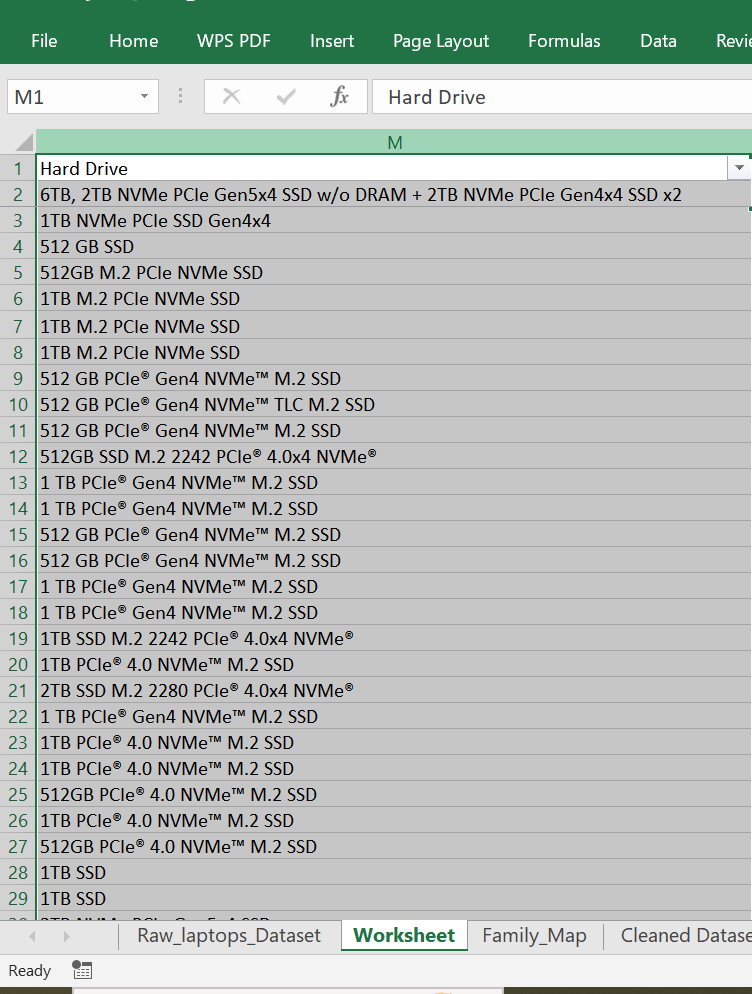

**After**

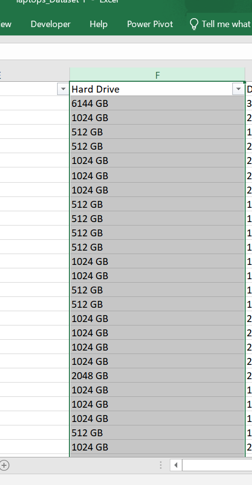

---

### 10. Display Resolution
The Display Resolution column had 20 missing values and significant formatting inconsistencies. The separator between width and height appeared as `'x'`, `'X'`, `'*'`, or `'×'`, with and without spaces on either side. Some values had surrounding text such as `'FHD 1920x1080,'` or `'2.5K (2560 x 1600, WQXGA)'`. One row contained Arabic numerals that no formula could handle.

The cleaning was done in two steps. First, all separator variants were replaced with a clean lowercase `'x'` and surrounding spaces were removed. Second, a formula extracted only the numeric width and height portion, stripping away any labels, brackets, or extra text. The one row with Arabic numerals was corrected manually.

**Before**

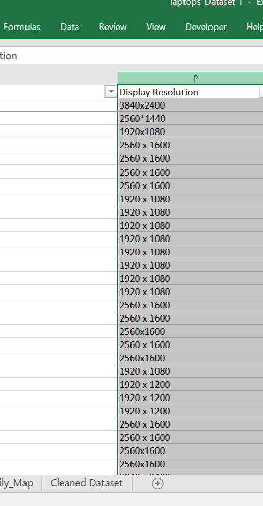

**After**

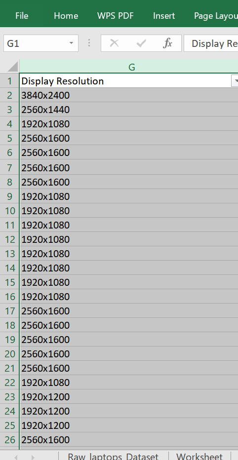

---

### 11. Display Refresh Rate
The Display Refresh Rate column had 353 missing values. The values present were inconsistently formatted the unit appeared as either `'Hz'` or `'HZ'` (different capitalisation) and spacing between the number and unit was inconsistent (`'120 Hz'` vs `'120Hz'`).

A formula was applied in a new adjacent column that extracts the numeric value and appends a standardised lowercase `'Hz'`, removing all spacing and capitalisation inconsistencies.

**Before**

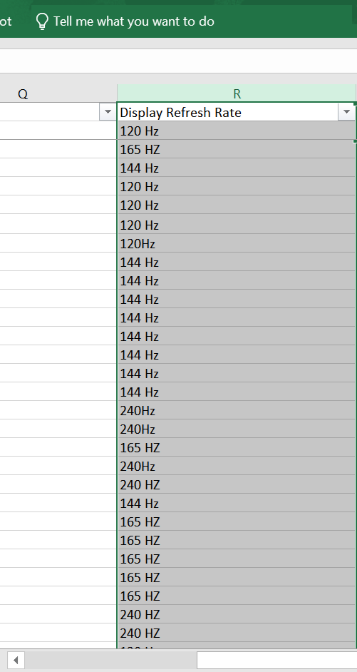

**After**

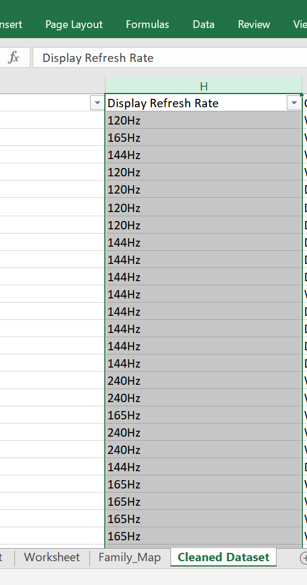

---

### 12. Operating System
The Operating System column had 37 unique variations of essentially the same 5 operating systems. Issues included the registered trademark symbol (`Windows® 11`), mixed case (`windows 11 home`, `WIN 10 Home`), dot notation (`Win.11`, `Win.10`), missing spaces (`Windows11 Home`), extra appended text (`Windows 11 Home - ASUS recommends Windows 11 Pro for business`), and multiple DOS variants (`DOS`, `Dos`, `FreeDOS`, `FreeDos`, `Free DOS`).

A formula was applied in a new adjacent column that searches each value for keywords (`11`, `10`, `pro`, `dos`) and maps it to one of five clean standardised categories. The search is case-insensitive so all casing variations are caught automatically.

**Before**

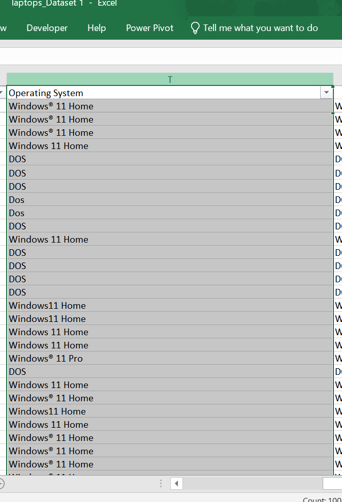

**After**

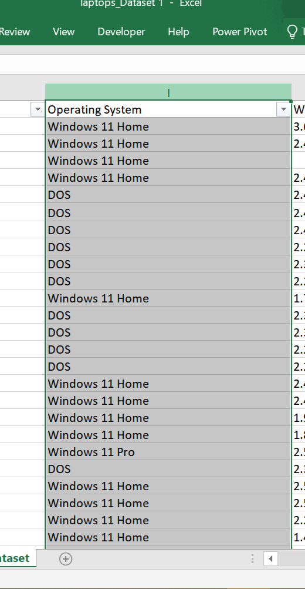

---

### 13. Weight
The Weight column had 40 missing values. While most values were in kilograms, they were inconsistently formatted the unit appeared as `'kg'`, `'Kg'`, or `'KG'`, and some entries had no space between the number and the unit (e.g., `'2.44kg'`). Three rows used grams (e.g., `'879 g'`) and one used pounds (`'1.94 lb (879 g)'`). One entry had a typo where the unit was written as `'gk'` instead of `'kg'`. Two entries had no unit at all.

A formula was applied in a new adjacent column that detects the unit in each cell and converts accordingly grams are divided by 1,000, pounds are multiplied by the conversion factor, and kilogram entries have their unit standardised to lowercase `'kg'`. Entries with no unit are assumed to be kg based on the numeric range. The typo `'gk'` was caught and treated as `'kg'`.

**Before**

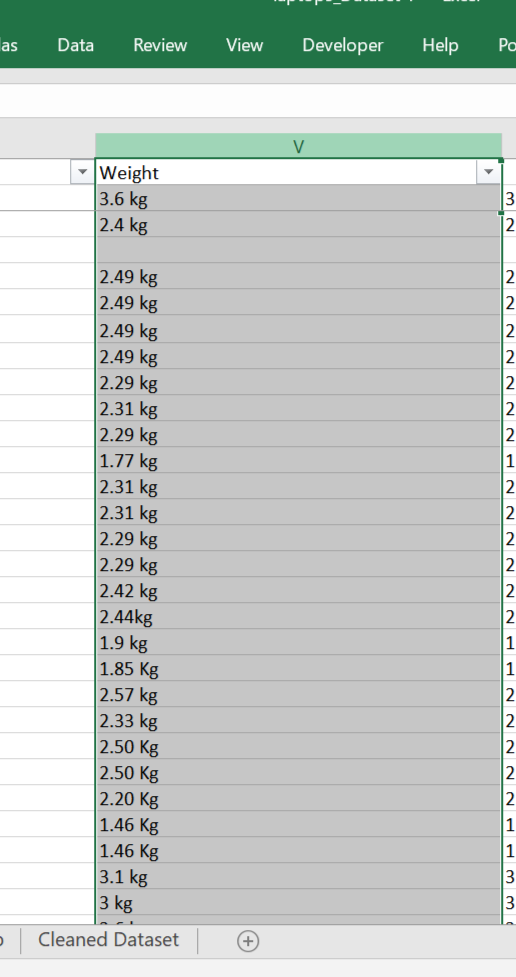

**After**

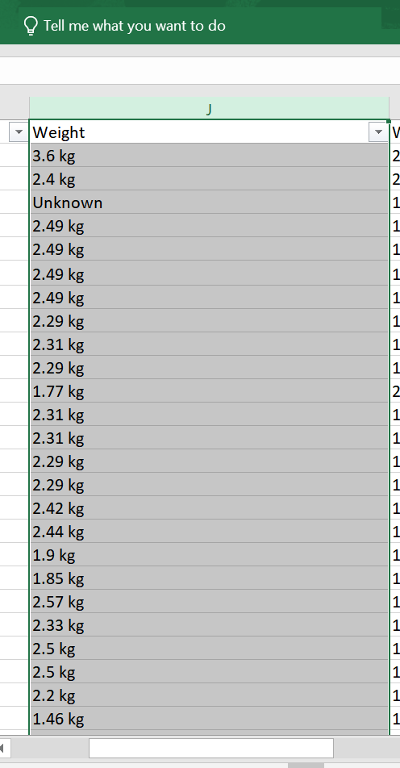

---

### 14. Warranty
The Warranty column had no missing values but contained 16 different variations of essentially three values (1 year, 2 years, 3 years). Problems included mixed case (`1 Year`, `1 year`, `1 YEAR`), missing spaces (`1Year`), inconsistent plural forms (`1 Year` vs `1 Years`), extra text (`1-year limited hardware warranty`), one Arabic word with no number (meaning 'year'), and one entry that simply said `'YEAR'` with no number.

A formula was applied in a new adjacent column that searches for the number 1, 2, or 3 in each value and returns a clean standardised label. The two entries that had no number could not be resolved by formula and were flagged as **'Check Manually'**.

**Before**

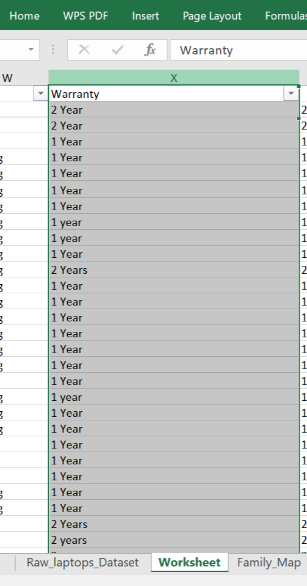

**After**

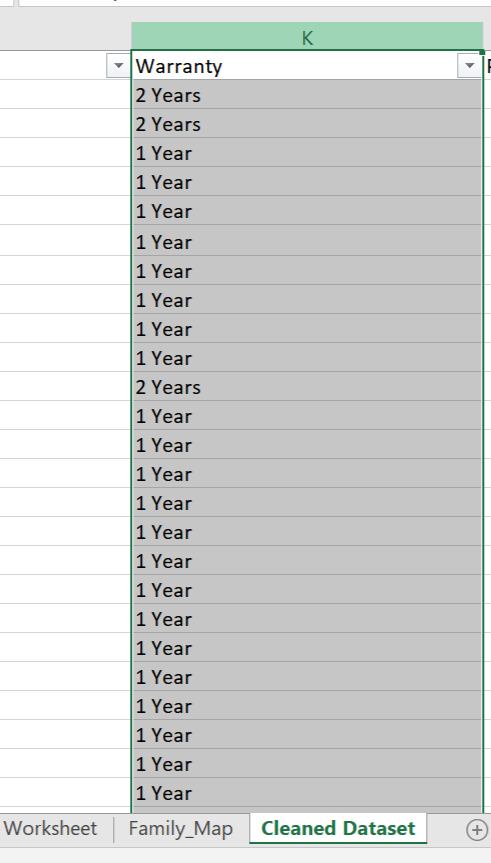

---

### 15. Price
The Price column was in Text data type. It was converted to **Currency data type** to enable aggregation, averaging, and numerical comparisons.

**Before**

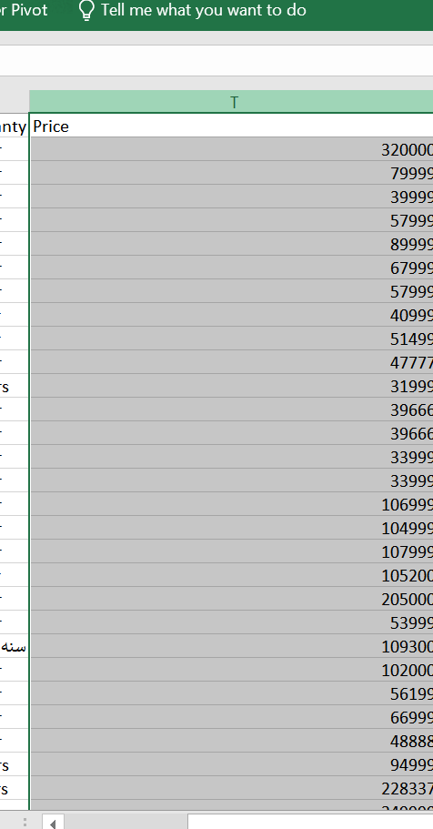

**After**

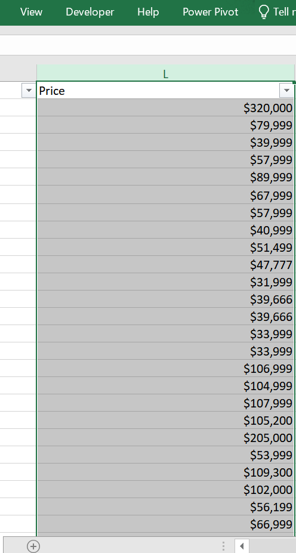

---

## Column Data Types & Descriptions

The table below documents each column retained in the final cleaned dataset, together with its assigned data type and a description of the values it contains.

| Column | Data Type | Description |
|---|---|---|
| Brand | Text | Manufacturer name (e.g., Dell, HP, MSI, ASUS) |
| Product Name | Text | Full commercial product title (e.g., Titan 18 HX Dragon Edition) |
| Processor | Text | Full CPU model name including special characters and version numbers |
| Processor Generation | Text | Generation of the processor (e.g., 13th Generation) |
| Processor Family | Text (Derived) | Standardised CPU family extracted from Processor column (e.g., Intel Core i7) |
| GPU Memory | Text → Numeric (GB) | VRAM size extracted and standardised from raw combined strings (e.g., 8GB) |
| RAM (GB) | Numeric (Integer) | System memory in GB, extracted from verbose specification strings |
| Hard Drive (Primary) | Text | Primary storage size as written, preserving original unit (TB or GB) |
| Hard Drive (GB) | Numeric (Integer) | Primary storage converted to GB for numerical comparisons |
| Display Resolution | Text | Cleaned resolution string in width×height format (e.g., 1920×1080) |
| Display Refresh Rate | Text → Numeric (Hz) | Standardised refresh rate (e.g., 144Hz); numeric value extracted |
| Operating System | Text (Categorical) | Mapped to 5 clean categories: Windows 11 Home/Pro, Windows 10 Home/Pro, No OS |
| Weight (kg) | Numeric (Decimal) | Weight in kg, converted from grams/pounds where applicable |
| Warranty (Years) | Text / Numeric | Standardised to 1 Year, 2 Years, or 3 Years; unresolved entries flagged as 'Check Manually' |
| Price | Currency (Numeric) | Market price converted from text to currency data type |
| Series | Text (Derived) | Product series extracted via keyword lookup from Product Name column |

---

## Recommendations for Improving Data Collection

The majority of cleaning work in this dataset was caused by problems that could have been prevented at the point of data entry. The following recommendations address each issue at its source.

- **Brand:** Instead of allowing free-text entry, the Brand field should be a mandatory dropdown list containing only the approved brand names in their correct format (MSI, HP, ASUS, Dell, Lenovo, etc.). This eliminates casing issues, typos, and missing values entirely.
- **Processor and GPU:** These should also be dropdown or autocomplete fields linked to a master reference list of valid processor and GPU model names. This prevents special characters (®, ™), inconsistent casing, and non-standard abbreviations from entering the data.
- **All numeric fields (RAM, GPU Memory, Weight, Hard Drive):** Numeric specifications should be collected in two separate fields: one for the number and one for the unit. For example, RAM should have a field for "16" and a separate dropdown for "GB". This prevents the verbose combined strings like `"16GB DDR5 6400MHz 48GB*2"` that required complex formula-based extraction.
- **Display Resolution and Refresh Rate:** These should be collected as structured fields. Resolution should have separate Width and Height fields (both numeric). Refresh Rate should be a numeric field in Hz only, with no text.
- **Weight:** Should be a numeric field in kg only. Grams and pounds should not be accepted as input. A note should be added to the form specifying the required unit.
- **Warranty:** Should be a numeric field (enter 1, 2, or 3) rather than a text field. This prevents the 16 variations of essentially three values that appeared in this dataset.
- **Processor Generation:** Should be auto-populated from a lookup table when the Processor model is entered, rather than filled manually.
- **Product Series:** Should be a structured field linked to the Brand selection. When a brand is selected, the Series dropdown should filter to only show series that belong to that brand.

---

## Validation Checks to Prevent Future Errors

These are rules that should be enforced at the point of data entry to block invalid values before they enter the dataset.

- **Mandatory field checks:** Brand, Processor, GPU, RAM, Price, and Display Resolution should all be required fields. Submission should be blocked if any of these are empty.
- **Data type checks:** RAM, GPU Memory, Weight, Price, Refresh Rate, and Warranty Year should only accept numbers. Any attempt to enter text in these fields should be rejected with an error message.
- **Range checks:** Price should be validated against a reasonable range (e.g., greater than 1,000 and less than 1,000,000). Weight should be between 0.5 kg and 6 kg. RAM should only accept standard values (4, 8, 16, 32, 64, 96, 128 GB). Refresh Rate should only accept values from a fixed list (60, 90, 120, 144, 165, 240, 300, 360).
- **Duplicate check:** A unique constraint should be enforced on the Product Name or Product Number field. If a product name already exists in the dataset, the system should alert the user before allowing a new entry to be saved.
- **Unit consistency:** Weight must be entered in kg only. GPU Memory and RAM must be entered in GB only. The system should not accept entries in grams, pounds, MB, or TB for these fields.
- **Controlled vocabulary for OS:** The Operating System field should only accept values from a fixed list (Windows 11 Home, Windows 11 Pro, Windows 10 Home, Windows 10 Pro, No OS). Free text should not be permitted.
- **Processor Generation format:** Must follow the pattern "Nth generation" (e.g., 13th generation). Any value not matching this format should be rejected.

---

## Suggested Processes for Maintaining Data Quality

Data quality is not a one-time task, it requires ongoing monitoring and automation to stay clean over time.

- **Automated null monitoring:** An automated check should run on every data import or update that counts the number of blank values in each column and sends an alert if any mandatory column exceeds 5% missing. This catches data collection problems early before they accumulate.
- **Weekly deduplication job:** A scheduled process should run every week that checks for duplicate Product Name and Brand combinations and flags or removes any that are found.
- **Master reference tables:** A central reference table for Brands, Processor families, GPU models, and Product Series should be maintained and kept up to date. All data entry forms should pull from these tables rather than allowing free text. When a new product is launched, the reference table is updated once and all forms immediately reflect the change.
- **Standardisation pipeline:** Any legacy data imported from external sources (e.g., Kaggle, supplier feeds, scraped data) should pass through a standardisation pipeline before entering the working dataset. This pipeline should apply the same cleaning rules used in this exercise automatically unit normalisation, casing standardisation, symbol removal before any analyst sees the data.
- **Data quality dashboard:** A simple dashboard should be maintained showing key metrics for each column: null rate, number of unique values, min/max for numeric columns, and any out-of-range flags. This gives the team a live view of data health without needing to run manual checks.
- **Cleaning documentation as living document:** This cleaning report should be treated as a living document. Every time a new data quality issue is discovered and resolved, it should be added to the report with the same structure used here. This builds an institutional record of known issues and how to handle them.
- **Periodic audits:** Every quarter, a data quality audit should be conducted on the full dataset checking for new duplicates, format drift, and columns that may have developed new inconsistencies due to changes in how data is being entered. This ensures problems are caught before they affect analysis.
